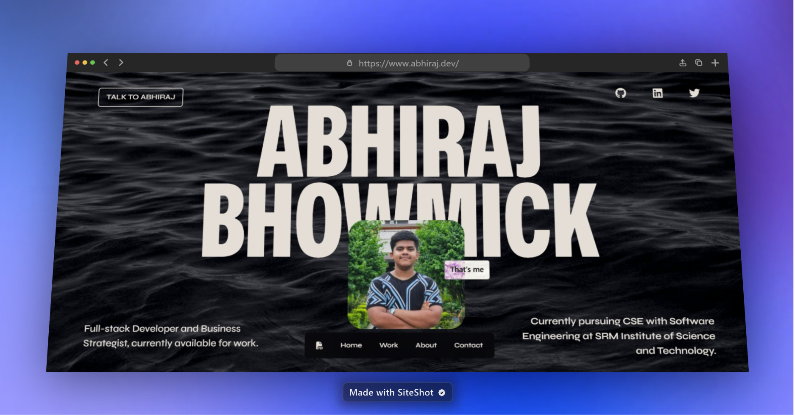

# Abhiraj Bhowmick — Portfolio v2

A modern, animated personal portfolio website built to showcase my work, skills, and personality. Designed with a dark aesthetic, smooth scroll-based animations, an interactive cursor experience, and a dedicated 3D skills gallery.

## About Me



I'm Abhiraj Bhowmick — a full-stack developer and business strategist currently pursuing CSE with Software Engineering at SRM Institute of Science and Technology, hailing from Siliguri, West Bengal. I enjoy working at the intersection of tech, communication, and problem-solving.

## ✨ Features

- **Hero Section** — Full-screen animated intro with profile image, social links, and a custom typeface (Mona Sans)
- **Work Section** — Project showcase with hover-driven card interactions and live demo links
- **About Section** — Personal bio, tech stack breakdown, and a movie recommendations carousel
- **Blog Section** — Dynamically fetched articles from external sources
- **Contact Section** — Animated "Let's Talk" CTA with email and calendar booking links
- **Skills Page** (`/skills`) — Interactive 3D infinite gallery showcasing certifications and skills, with autoplay, scroll, swipe, and keyboard navigation
- **404 Page** — Retro TV-themed error page with CSS art and glitch animations
- **Interactive Cursor** — Blobity-powered magnetic cursor with tooltips across the site
- **Smooth Animations** — Scroll-triggered text and element animations using Framer Motion & GSAP
- **Responsive Design** — Fully responsive across mobile, tablet, and desktop
- **Floating Navbar** — Fixed bottom navigation bar with smooth scroll to each section and a link to the skills page

## 🛠 Tech Stack

| Category | Technologies |
|---|---|
| **Framework** | Next.js 13 (App Router) |
| **Language** | TypeScript |
| **Styling** | Tailwind CSS, CSS3 |
| **3D / WebGL** | Three.js, React Three Fiber |
| **Animations** | Framer Motion, GSAP |
| **Fonts** | Syne (Google Fonts), Mona Sans (local) |
| **Icons** | Font Awesome |
| **Cursor** | Blobity |
| **Analytics** | Vercel Analytics |
| **Hosting** | Vercel |

## 📂 Project Structure

```
app/
├── hero-section/       # Full-screen hero with profile & social links
├── work-section/       # Project showcase grid
├── about-section/      # Bio, tech stack, and movie carousel
├── blog-section/       # Blog articles grid
├── contact-section/    # Contact CTA with social links
├── skills/             # Skills page route (/skills)
├── skills-section/     # 3D infinite gallery component & skill images
├── navbar/             # Fixed bottom navigation bar
├── footer/             # Site footer
├── animations/         # Shared animation components & configs
├── fonts/              # Local Mona Sans font files
├── utils/              # Blobity cursor configuration
├── not-found.tsx       # Retro TV 404 error page
├── not-found.css       # 404 page styles
├── layout.tsx          # Root layout with Syne font & metadata
├── page.tsx            # Main page assembling all sections
└── globals.css         # Global styles & Tailwind directives

public/
└── skills/             # Certification & skill images for the 3D gallery
```

## 🏃 Run Locally

Clone the project:

```bash
git clone https://github.com/rainboestrykr/portfolio-v2.git
```

Go to the project directory:

```bash
cd portfolio-v2
```

Install dependencies:

```bash
npm install
```

Start the development server:

```bash
npm run dev
```

Open [http://localhost:3000](http://localhost:3000) in your browser.

Visit the skills gallery at [http://localhost:3000/skills](http://localhost:3000/skills).

### Other Scripts

```bash
npm run build   # Production build
npm run start   # Start production server
npm run lint    # Run ESLint
```

> **Note:** This project includes an `.npmrc` with `legacy-peer-deps=true` to handle a broken peer dependency in the `blobity` package. This is required for both local installs and Vercel deployments.

## 🔗 Links

- **Portfolio** — [abhiraj.dev](https://abhiraj.dev/)
- **GitHub** — [github.com/rainboestrykr](https://github.com/rainboestrykr)
- **LinkedIn** — [linkedin.com/in/abhiraj-bhowmick](https://linkedin.com/in/abhiraj-bhowmick/)
- **Twitter** — [twitter.com/rainboestrykr](https://twitter.com/rainboestrykr)
- **Email** — [abhirajbhowmick27@gmail.com](mailto:abhirajbhowmick27@gmail.com)
